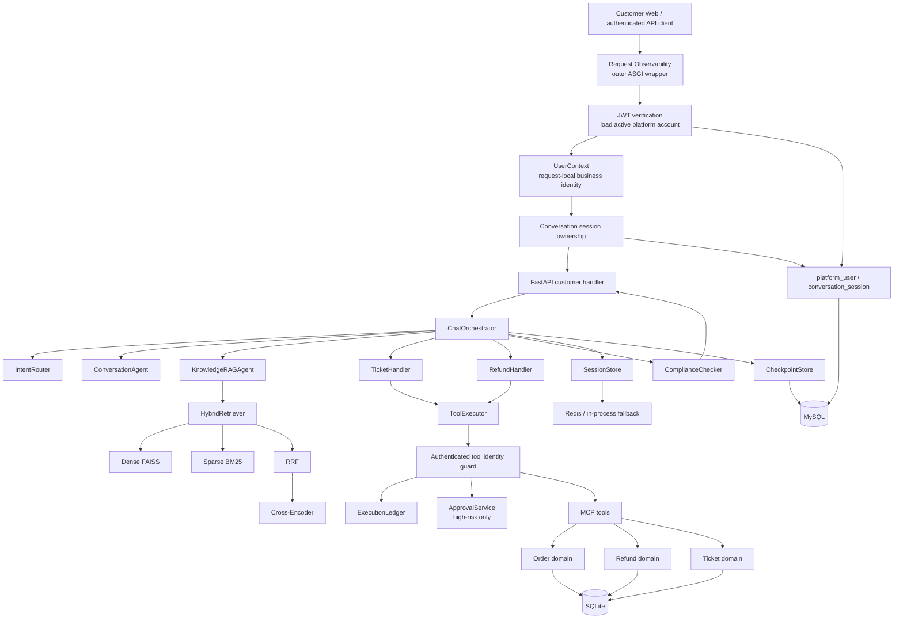
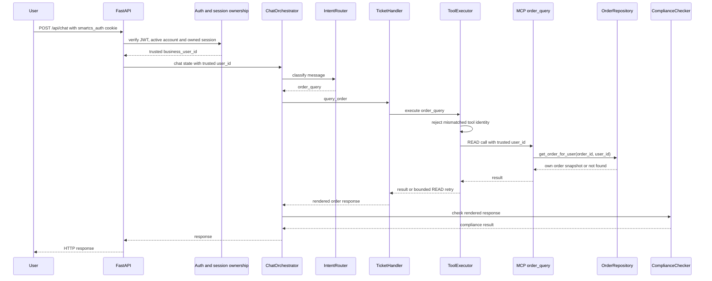
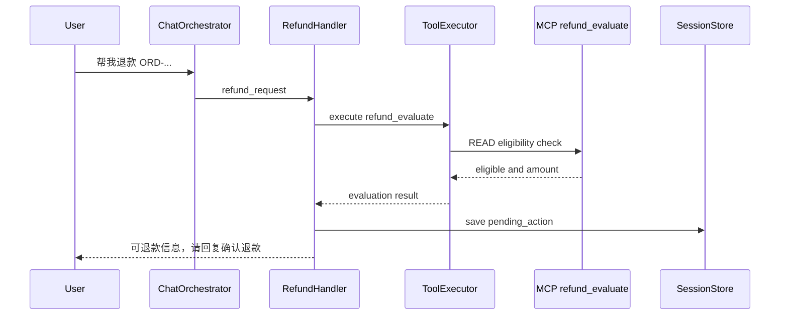
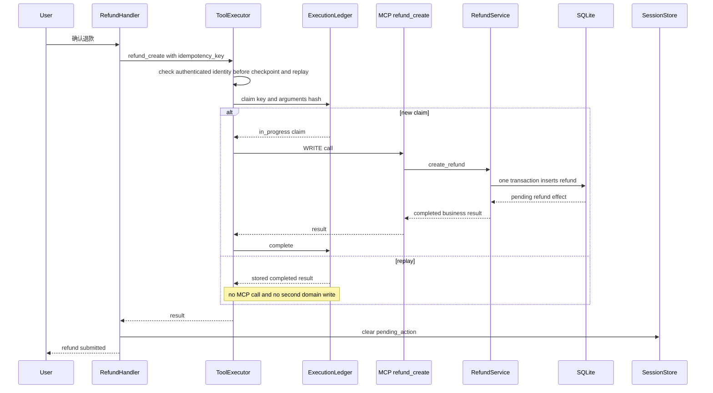
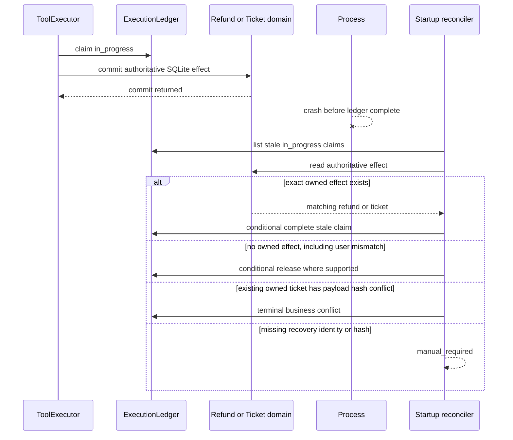

# SmartCS 架构说明

这份文档面向代码评审、项目演示和面试沟通。它只解释当前本地实现，不把可选的生产扩展写成已经存在的能力。

2026-09-19 认证与客户隔离已通过本地验收：认证阶段全量 pytest 351 项，认证专项 63 项、checkpoint 专项 14 项分别复验通过，另有 Node 15 / 15、两个真实进程崩溃窗口及独立 HTTP / Chrome 验收。2026-09-20 RAG runtime isolation 收尾后，最终默认回归为 `367 passed, 18 skipped`，RAG runtime closure 已通过并冻结。完整认证结论见 [执行报告](../artifacts/auth_20260919/execution_report.md)；下文 284 项 pytest、Eval 14 / 14 和 3 项 Node 测试均为 2026-09-18 checkpoint 阶段的历史基线，不与后续数量相加。

## 1. 组件边界



请求先经过外层 ASGI 可观测性包装器；客户接口再通过 FastAPI 认证依赖获得可信身份。这样，包含异常响应在内的请求都可以获得相关的 `X-Request-ID` 和聚合指标。涉及已有会话的读取、继续、删除和发消息操作，须先校验当前账号拥有该会话。`ChatOrchestrator` 负责恢复会话、路由意图、选择业务 Handler、执行合规检查和合成响应。

成功路由后最多执行一个响应分支。低置信度或未知路由直接要求澄清。`ConversationAgent` 处理问候、身份、能力说明、致谢及相关上下文追问，只接收近期对话，不接入知识库或业务工具；输出仍经过统一合规检查。`KnowledgeRAGAgent` 是知识检索分支，通过共享 `HybridRetriever` 依次访问 Dense FAISS、Sparse BM25、RRF 和 Cross-Encoder，不把知识检索包装成业务写操作。订单查询、退款和工单等业务 Handler 使用 `ToolExecutor` 进入 MCP 工具和业务域。

### 认证与会话归属

`POST /api/auth/login` 验证 MySQL 账号的 Argon2 密码哈希后，设置名为 `smartcs_auth` 的 HttpOnly JWT cookie。浏览器 JavaScript 不读取 JWT，也不把 JWT 写入 localStorage。JWT 的 `sub` 是平台账号 ID，不是业务用户 ID；每次请求校验签名、期限和发行者后，都用 `sub` 重新读取 `platform_user`，要求账号仍为 `active`，再构造不可变 `UserContext`。其中 `business_user_id` 才是 Agent 使用的 `user_id`，通过 `ContextVar` 在请求内传递，请求结束后重置。

客户端不能通过聊天、历史或 checkpoint 参数选择可信 `user_id`；查询参数中的身份字段会被拒绝。`POST /api/chat` 不带 `session_id` 时由服务端创建会话，Web 也可以先调用 `POST /api/sessions` 取得服务端 ID。会话列表按平台 `account_id` 过滤；已有会话必须先匹配 `conversation_session` 的归属，再以认证上下文中的业务身份访问 checkpoint，保留原 checkpoint 归属检查。另一账号知道会话 ID，也不能读取或恢复该会话。

登录、退出及 cookie 认证的写请求检查 `Origin`，或在没有 `Origin` 时检查同源 `Referer`；缺失或不匹配时拒绝。CORS 默认同源，跨源开发只接受 `CORS_ALLOWED_ORIGINS` 精确白名单，不能使用带凭据的通配来源。cookie 启用 HttpOnly、SameSite 限制，并通过 `AUTH_COOKIE_SECURE` 区分本地 HTTP 与 HTTPS 配置。API 客户端也可使用 Bearer token；这不允许客户端指定业务身份。

`POST /api/auth/logout` 仅清除浏览器 cookie，没有 JWT 撤销表或 refresh-token 轮换。已复制的有效 token 在到期前仍可能使用，当前有效期最多 30 分钟；账号停用会在下一次账号查询时生效。此处是客户身份认证与用户级归属隔离，不是 RBAC、SSO 或企业 IAM。

## 2. 四类状态

| 状态类别 | 所有者 | 内容和边界 |
| --- | --- | --- |
| 平台身份与会话归属 | MySQL `platform_user` + `conversation_session` | 账号、密码哈希、账号状态、业务身份映射及会话所属账号；与工作流进度分开保存 |
| 会话与工作流状态 | `SessionStore` + MySQL `CheckpointStore` | `last_intent`、累积实体、轮次、退款 `pending_action`、节点结果；消息历史存于 append-only `conversation_event`，API 使用 MySQL 权威事件与游标 |
| 执行状态 | `ExecutionLedger` | 写操作的 `idempotency_key`、参数 hash、执行中、完成、失败和可恢复 payload |
| 业务状态 | 订单、退款、工单 domain 和 SQLite | 订单归属、退款效果、工单内容和状态，是业务有效性与业务结果的权威来源 |

API 已接入 MySQL CheckpointStore，认证和会话索引复用同一 MySQL 实例及数据库，没有迁移 SQLite 业务表。Redis 缺失或过期不影响已保存节点恢复。未注入 checkpoint store 的离线兼容链路仍使用 Redis / in-process fallback，不提供工作流恢复。长期知识内容属于 `LongTermMemory` 的 FAISS 索引，不是会话状态，也不是执行 ledger。

`platform_user` 保存平台自增 `id`、唯一 `username`、`password_hash`、唯一 `business_user_id`、`status` 与时间戳。`conversation_session` 保存 `session_id`、所属 `account_id`、标题、初始请求 ID 与时间戳，外键指向平台账号；账号和初始请求 ID 的唯一约束用于去重首次聊天重试。字段定义见 `platform_db/database.py`。SQLite 继续拥有 `users`、订单、支付、物流、退款、工单及执行账本，不承担平台登录认证。

MySQL 的 `agent_checkpoint` 表使用自增 `id` 和唯一 `session_id`，保存 `user_id`、`state_json`、`status`、`version`、`created_at`、`updated_at`；`agent_checkpoint_request` 保存已完成请求回执。前者记录当前会话进度，后者保留跨轮请求去重依据，字段定义以 `checkpoint/store.py` 为准。

节点顺序为 `PREPARED → ROUTED → EXECUTING → GENERATED → REVIEWED → FINISHED / WAIT_CONFIRM`。快照状态分别使用 `running`、`finished`、`waiting`；`FINISHED` 对应设计方案中的 `COMPLETED`。已完成节点跳过，未完成模型调用重跑；待确认退款只能由新的明确确认消息推进，显式 resume 不代用户确认。完成响应与请求回执同一个 MySQL 事务保存，后续新轮不覆盖旧请求的回放凭据。

每会话的 MySQL 连接锁与版本 CAS 控制执行归属；所有 MySQL 驱动调用通过 `asyncio.to_thread`，取消请求时先等待线程操作结束再释放连接。工单分析与 WRITE 参数/幂等键/确认依据在调用前保存，业务执行后仍由原 ExecutionLedger 回放。MySQL 失败或快照非法时停止，不降级为可疑内存执行。该路径没有跨库分布式事务，也不是任意外部工具 exactly-once。

恢复接口、状态字段、配置、测试开关和生命周期详见 [README 的断点恢复说明](../README.md#mysql-节点级断点恢复)。

实现中的不变量是：

- Agent 决定意图和交互方式。
- 认证依赖决定可信身份；模型和客户端不能修改业务用户身份。
- Agent output is not authoritative business state。
- `ToolExecutor` 决定确认、审批、超时、READ 重试和写入幂等策略。
- Domain 决定权威的业务有效性和业务状态。
- `ExecutionLedger` 决定一次执行的 replay、冲突或进行中状态。
- `SessionStore` 只拥有对话状态，不拥有退款或工单的最终业务结果。

### Round 1 离线 RAG 索引边界

`rag/` 与 `scripts/build_rag_indexes.py` 负责把 `apple_support` 和 `agent_engineering` 分域构建为可复现的离线材料：源文件经结构感知分块和确定性上下文前缀后，分别写出 FAISS dense artifact、BM25 corpus/index preparation 及 manifest。每个 chunk 同时保留原始 `content` 和用于检索的 `retrieval_text`；Markdown front matter 只作为来源元数据，PDF 使用嵌入文本提取，URL-only 文本只记录 unresolved 状态。

Round 1 配置目标为 `BAAI/bge-m3`、1024 维，并提供不下载模型的确定性测试 backend。该轮不实现在线 RRF、Cross-Encoder、混合检索或 benchmark；`agents/knowledge_rag.py` 现有的 Query rewrite、FAISS 检索和重排链路保持兼容，后续轮次再单独改变在线检索行为。

### Round 2 在线混合检索边界

Round 2 在 `rag/` 提供统一的在线 `HybridRetriever`：保留原始问题用于回答，使用 Query rewrite 结果进行 Dense 与真实 BM25 检索，再按 RRF 融合并交给可注入的 Cross-Encoder reranker。`KnowledgeRAGAgent` 与 MCP `knowledge_search` 共享该层；两个 domain 的 artifact 会校验 manifest、chunk 顺序、FAISS ntotal/dimension、BM25 chunk IDs 以及实际 embedding backend/model，校验失败直接拒绝服务。测试可显式允许 `dry_run` artifact，生产默认拒绝；检索 refinement 最多两轮。

Round 3 已在 `rag/evaluation/` 与 `benchmarks/rag/` 落地固定 query/qrels 的双域 Retrieval Benchmark：同一组 global Top-20 候选依次评估 Dense、BM25、RRF 与真实 BGE Cross-Encoder，计算 Recall@K、MRR、nDCG 并记录 `wrong_domain_rate@K` 与失败案例。评测开始前会校验 benchmark manifest 的 production chunk hash；真实模型不可执行或 hash 不匹配时 fail closed。最终机器可读产物写入 `artifacts/rag_round3/`。

生产和测试的 retriever 依赖边界已固定：`api/main.py` 默认 `get_retriever()` 读取生产环境配置；显式传入 `LongTermMemory` 的 Orchestrator、MCP 和 Eval 使用 `get_retriever(use_env=False)`，只访问该内存，不读取 `RAG_INDEX_ROOT`。这条隔离规则由 MCP 与 Orchestrator 回归测试覆盖。

## 3. ToolExecutor 的写入边界

聊天链路中的副作用工具由业务 Handler 调用 `ToolExecutor`。客户的 `/api/tools/call` 和 `/api/tools/execute` 均要求认证，只允许 `order_query`、`refund_evaluate`、`ticket_query`、`knowledge_search` 四个 READ 工具；WRITE 必须走聊天及既有确认、幂等策略，客户不能通过 `confirmed=true` 自行开放写入口。CLI business simulator 是独立的合成订单状态模拟路径，不能据此声称所有进程内业务变化都经过同一个 HTTP 执行入口。

`ToolExecutor.execute` 和 `MCPToolServer.call_tool` 共用 `customer_tool_arguments`，保护订单查询、退款评估、退款创建、工单创建及工单查询五个业务工具。有认证上下文时，缺少 `user_id` 就注入认证业务身份；显式传入不同身份则拒绝。执行器在保存 checkpoint 写计划及读取 ledger 回放之前做此检查，不能通过命中旧结果绕过身份约束。没有认证上下文的离线内部调用保留原有直接工具语义，不是匿名 HTTP 访问通道。

当前工具策略如下：

- READ 工具可以按 `retryable` 和最大尝试次数进行有限重试。
- WRITE 工具不自动重试，必须有确认和 `idempotency_key`，并要求 `ExecutionLedger`。
- 只有 `risk_level=high` 的工具需要 `ApprovalService`。当前 `refund_create` 和 `ticket_create` 是 medium risk，需要确认和幂等，但不会自动要求人工审批。
- 业务拒绝是一次已经完成的工具调用，不会被当成传输异常再次重试。

## 4. 订单查询时序



订单查询是 READ，不需要写 `ExecutionLedger`。如果工具注册为可重试，重试只由 `ToolExecutor` 的 READ 策略控制。订单归属不匹配时返回与不存在相同的结果，不返回他人订单详情；`/api/demo/orders` 调用 `list_orders_for_user`，只列出当前认证用户的订单。

## 5. 两轮退款流程

退款先评估，再等待明确确认。第一轮不会创建退款记录：



第二轮只有在当前用户确认，并且仍存在匹配的待确认状态时才创建：



重复到达同一个 `idempotency_key` 且参数一致时，`ExecutionLedger` 返回已保存的结果，不再创建第二条退款。退款评估和创建仍由 `RefundService` 核对订单与可信业务用户的归属，不匹配时不产生退款记录，也不返回支付金额或退款明细。成功处理后会话中的 `pending_action` 会被清除；之后再次只发送确认文字，得到的是“当前没有待确认退款”，这本身不等同于 replay。

## 6. 崩溃窗口与受限恢复

写入存在一个需要协调的窗口：



当前只有 `refund_create` 和 `ticket_create` 有对应的权威业务查询，因此只有这两个写工具支持上述恢复。应用启动时只扫描达到 stale threshold 的 `in_progress` claim，默认阈值为 60 秒，单次最多处理 100 条。checkpoint 显式恢复时还会对该请求已保存的当前幂等键进行相同阈值的受限协调，避免启动时尚未到阈值的请求永久卡住；不会扫描无关请求。这不是持续恢复 daemon，也不能宣称任意写操作全局 exactly once。

退款恢复按订单和用户查找既有退款效果。工单恢复同时检查 `client_request_id`、`user_id` 和 payload hash。只有在同一用户的既有工单被找到且 payload hash 不匹配时，才完成为 terminal business conflict，不返回旧工单号，也不自动重试。若用户不匹配，带用户条件的查询结果为空，按无效果路径 conditional release。缺少恢复身份或 hash 时进入 manual path。不能把这套逻辑推广成任意 WRITE 工具的自动修复。

## 7. 工单身份与用户隔离

`idempotency_key` 是执行层的回放键，回答“同一次执行是否已经完成”。`client_request_id` 是工单业务请求身份，回答“这个客户端请求是否已经创建过业务工单”。工单服务会对用户、标题、描述、优先级和 category 做规范化后计算 payload hash。

同一 `client_request_id` 和同一 hash 会 replay。不同 hash 会返回 `client_request_conflict`，不会返回已存在工单的旧 metadata。工单查询必须同时匹配 `ticket_id` 和认证上下文提供的业务 `user_id`，因此不匹配时不会得到工单内容。客户不能通过工具参数改写这一身份，恢复也要求用户身份和 payload hash 一致。业务服务的归属检查、工具身份检查与 HTTP 认证分别承担不同层的约束，不以提示词代替权限控制。

## 8. 合规、审批与运行时可观测性

合规检查先执行本地规则，再调用 LLM 处理规则没有覆盖的情况。规则命中高风险内容时直接拦截。当前 JSON 解码失败 fallback 为通过，因此这是一个已知的实现边界，不能描述为安全 fail-closed。

运行时观测链路为：

```text
HTTP request
    ↓
request_id ContextVar
    ↓
InstrumentedToolExecutor
    ↓
sanitized operational log + RuntimeMetrics
```

外层 ASGI 包装器在 FastAPI handler 之前设置 `request_id ContextVar`，并把请求完成、状态码和请求耗时写入聚合指标。工具层记录工具标签、执行状态、尝试次数、replay、超时和 duration。恢复层记录扫描、完成、释放、manual_required 和 skipped。本轮实现的运行时操作日志不包含工具 arguments、result 或自由文本业务内容，该说明不覆盖项目中的所有日志。聚合指标通过要求登录的 `/api/metrics/runtime` 暴露，OpenTelemetry collector 是可选项。

含原始工具调用明细的 `/api/metrics` 和所有 `/api/approvals` 路由均拒绝客户访问。项目本轮没有管理员角色或 RBAC，因此“内部接口保留”不代表提供了可登录的管理后台；审批服务仍用于内部执行策略和离线测试。

## 9. Eval 与验证边界

`pytest` 检查组件和集成合同，覆盖路由、工具边界、业务域、恢复和 API 行为。离线 Eval runner 使用 Deterministic LLM 和本地业务 Sandbox，按端到端场景检查：

- 路由是否命中预期 Handler。
- 未确认时是否没有副作用。
- 退款和工单是否产生恰好一个持久化效果。
- READ 失败是否有界重试，WRITE 是否不自动重试。
- 故障注入后是否能保持副作用隔离和失败收敛。

2026-09-18 checkpoint 阶段的历史全量复验为 `284 passed in 58.14s`，验收报告见 [checkpoint_test_report.md](../artifacts/checkpoint_20260918/checkpoint_test_report.md)，原始输出见 [full_suite.txt](../artifacts/checkpoint_20260918/full_suite.txt)；同阶段另有原有 Eval 14 / 14 和 3 项 Node 测试。284 项中包含 14 项 checkpoint 测试，真实 MySQL 测试需显式开启；另有真实进程终止、重启和浏览器验收。原有 Eval 的 pass rate、routing accuracy、side-effect safety rate 和 failure containment rate 均为 1.0，但这 14 个场景未新增 checkpoint 场景，不能用其数字代替恢复验收。其他验收证据见同目录 `round1_acceptance.md`；更早的 253 项和增量前的 270 项仅为历史基线。这些结果不说明在线 LLM 回答质量、生产流量、生产 SLA 或远程 CI 已执行。这里不使用 LLM-as-judge，因为目标是检查可重复的业务不变量与副作用边界。

2026-09-20 最终本地验证结果如下；认证、checkpoint 和 RAG isolation 专项均包含在全量 pytest 内，不重复计数：

| 验证范围 | 结果 | 原始证据 |
| --- | --- | --- |
| 认证阶段全量 pytest | `351 passed in 71.72s` | [full_suite.txt](../artifacts/auth_20260919/full_suite.txt) |
| 认证、会话权限、业务隔离专项 | `63 passed in 28.67s`；对应 `tests/test_auth.py`、`tests/test_user_sessions.py`、`tests/test_user_business_isolation.py` | [auth_tests.txt](../artifacts/auth_20260919/auth_tests.txt) |
| Checkpoint 专项 | `14 passed in 21.34s` | [checkpoint_tests.txt](../artifacts/auth_20260919/checkpoint_tests.txt) |
| Node 回归 | 15 / 15 | 主 Agent 已完成验证，汇总见 [执行报告](../artifacts/auth_20260919/execution_report.md) |
| RAG runtime isolation 收尾 | `367 passed, 18 skipped`；两种顺序回归、Eval 14 / 14、Node UI 15 / 15 | [`artifacts/smartcs_final_20260920/`](../artifacts/smartcs_final_20260920/)；无算法或索引改动 |
| 双域 Retrieval Benchmark | `hybrid_rerank` global Top-10：Recall 0.825、MRR 0.800、nDCG 0.749、wrong-domain rate 0.063 | [`artifacts/rag_round3/metrics.json`](../artifacts/rag_round3/metrics.json)；固定 60 条 query/qrels |
| 两个真实进程崩溃窗口 | 业务已提交/账本未完成、账本已完成/checkpoint 未推进均通过；各场景退款始终 1 条，最终 replay 的 LLM 调用为 0 | [checkpoint_process.json](../artifacts/auth_20260919/checkpoint_process.json) |
| 独立 HTTP / Chrome | PASS；真实 JWT / MySQL、后端重启、待确认恢复、登录和账号隔离均通过 | [browser_restart.json](../artifacts/auth_20260919/browser_restart.json) |

独立 HTTP 验收使用真实 Argon2 登录、HttpOnly JWT cookie 和 MySQL，业务数据位于隔离临时 SQLite，模型为确定性替身。后端进程由 26244 重启为 4240；`WAIT_CONFIRM` 不自动退款，确认并 replay 后退款仍为 1 条，账号 B 读取、恢复和删除 A 的会话均返回 404。Chrome 验证本人订单、历史刷新、待确认刷新、丢失 POST 后继续、logout 清空页面数据及切换账号隔离均通过。主 Agent 已查看截图，未发现明显布局问题；这些结果属于本地验收，不是生产部署或在线模型质量证明。

真实进程回归使用确定性模型，重启恢复阶段仍有必要的后续模型调用；LLM 调用为 0 仅指完成后的同请求 replay，不是所有恢复阶段均不调用模型。历史 Eval 14 / 14 不代替本轮认证证据；Node 回归与独立浏览器验收分别记录，不混为同一项检查。

## 10. 本地目标与后续扩展

当前实现适合本地 SQLite 业务 Sandbox。客户身份来自 JWT 校验后的平台账号，认证与会话表复用 checkpoint 所在 MySQL；MySQL 会话连接锁与版本 CAS 并不代表跨主机 SQLite 共享、跨库事务或完整多实例部署。没有公共注册、密码找回、OAuth、SSO、RBAC、管理后台、refresh-token 轮换或 JWT 撤销表。

MySQL 会话与回执没有自动过期；清理非运行中会话会同时删除 checkpoint 回执。Web 刷新后须保持登录，并经账号归属检查恢复会话和显式继续；恢复不能自动确认退款。旧 TUI 仍使用匿名 `user_id` 协议，已被客户 API 拒绝，本轮不将其列为可用验收入口。SSE、SQLite 业务数据迁移和多区域部署均不在本轮范围内。
